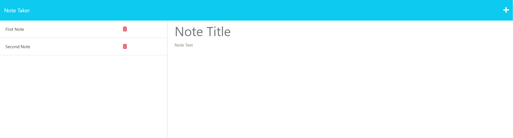

# Note Taker Express

## Description

The ability to take notes allows anyone to keep track of vital information, and providing an interface for that purpose is what this application aims to do. This application saves notes to a server that keeps the information stored securely.
This project will eliminate your note-taking issues.

## Table of Contents

- [Usage](#usage)
- [Credits](#credits)
- [License](#license)
- [Screenshot](#screenshot)

## Installation

Go to https://note-taker-benbryant.herokuapp.com/

## Usage

Go to https://note-taker-benbryant.herokuapp.com/

## License

Project is licensed under MIT.

---

## Features

Express.js, Heroku, Node.js

## How to Contribute

Contributions can be made to the project by visiting https://github.com/benbryant98/note-taker-express

## Screenshot

## Questions

Github: https://github.com/benbryant98

Email: bryantbc98@gmail.com
